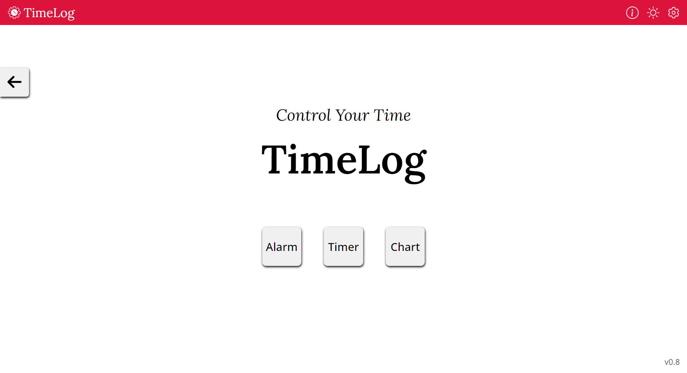
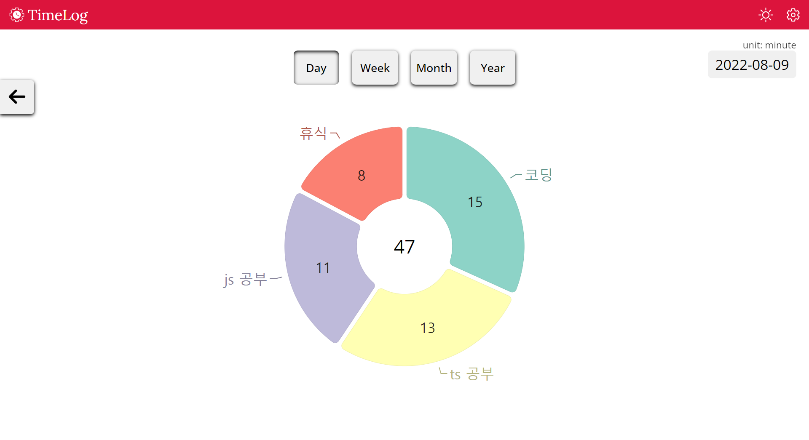
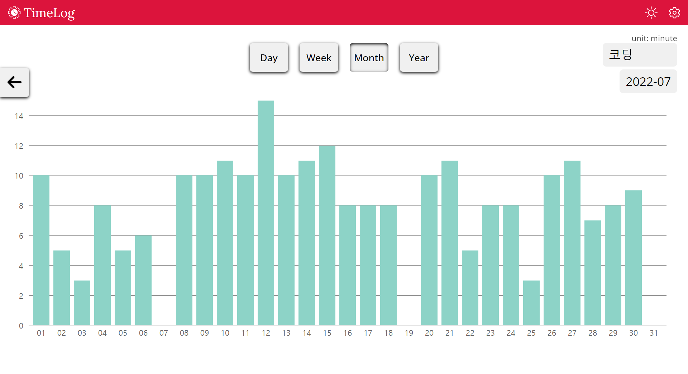
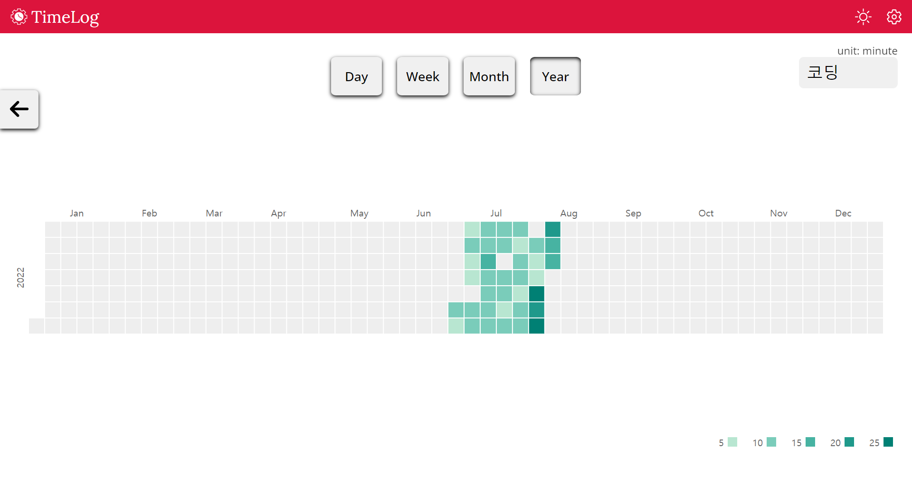

## [TimeLog](https://saramkim.github.io/time-log/)

Skills : **React, Typescript, Redux, Sass**   

시간 관리 웹 사이트입니다.

시간의 기록을 여러 차트를 활용해 확인할 수 있습니다.

- ### v0.8
  - PC 브라우저에서만 타이머 정상 작동 (모바일 백그라운드에서 타이머 지연)
  - 로컬스토리지를 이용하여, ‘쿠키 및 기타 사이트 데이터’ 삭제 시 데이터 소멸
  - 추후 로그인 기능을 도입하여 아이디 간 데이터 연동, 모바일 정상 지원 예정
